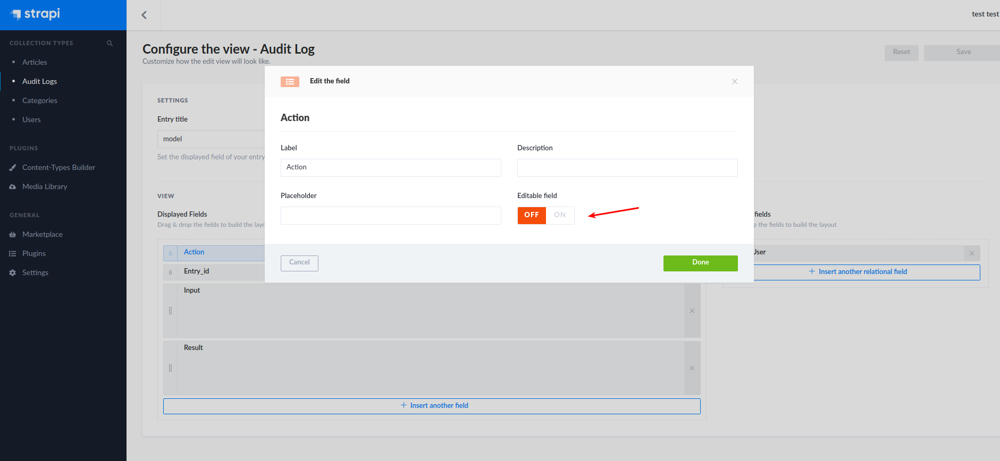

# Strapi Audit Log examples

This repo is an example of 2 different ways to possibly implement an audit log:

- Lifecycle Methods
- Plugin (using a custom middleware)

Both methods store:

- The action used (create, update, delete, ect)
- The model being targeted
- The ID of the entry in the model (excluding bulkdelete for the plugin example)
- The input data and params
- The final result after the action (delete will still show the data, but the data will no longer exist on that model)
- The **Admin User** that performed the action

Note that final entry in the list is important as it will not track **end-user** requests (I didn't test this so the lifecycle method may throw some errors). For the plugin method it doesn't matter since the middleware only tracks updates from the Content-Manager plugin.

## Lifecycle Method

In the [basic-example](./basic-example) we have a [core function](./basic-example/config/functions/createAuditLog.js) that handles creating the audit-log entries. These logs are saved to the [audit-log model](./basic-example/api/audit-log/models/audit-log.settings.json).

The way this is done is via using lifecycle methods, in this example we have some custom logic in the [article lifecycles](./basic-example/api/article/models/article.js). The few actions that are currently handled are:

- create
- update
- delete
- publish (by checking the fields updated)
- unpublish (by checking the fields updated)

In this example, it is not possible to log the bulk delete because that is only handled by the Admin which has it's own internal query method that doesn't have a lifecycle.

The downside to this method is you **must** replicate this lifecycle logic to every model that you wish to use it on. It's useful if you only need to store audit information on a single model.

## Plugin Method

**Pre-word**: I used a plugin so I could write the middleware and the model in one package, technically you could build a normal audit-log model and a normal custom middleware and forgo the plugin method entirely

In the [plugin-example](./plugin-example) a [middleware](./plugin-example/plugins/audit-log/middlewares/audit-log/index.js) (this is enabled by default) and an audit-log [model](./plugin-example/plugins/audit-log/models/audit-log.settings.json) is provided. **Note** that there are no settings, custom UI, and no end-user endpoints to this model.

Effectively this plugin will track all updates to any model from any plugin with the exception of the audit-log model itself and includes the following actions:

- create
- update
- delete
- bulkdelete
- publish
- unpublish

Since this is a middleware, all of the tracked actions come directly from native admin panel actions and are not being wrapped around the database queries. This makes it much more flexible and "automatic".

A small suggestion here would be to modify the "view" of the audit-log model to disable modification to the fields as such:

## Final Word

These are just samples, they could be much simpler or FAR more complex, especially with the plugin which could be built into a full community plugin with enough effort complete with some custom UI for the logs, and settings to enable/disable logging of certain models. With enough effort you could also implement some permissions on who can view/edit/delete log entries, ect.

The hardest thing to implement would be storing a copy of the data before modification (like in the case of an update) due to the logic needed in the middleware. Thus implementing something like a "roll-back" feature would be quite hard.
